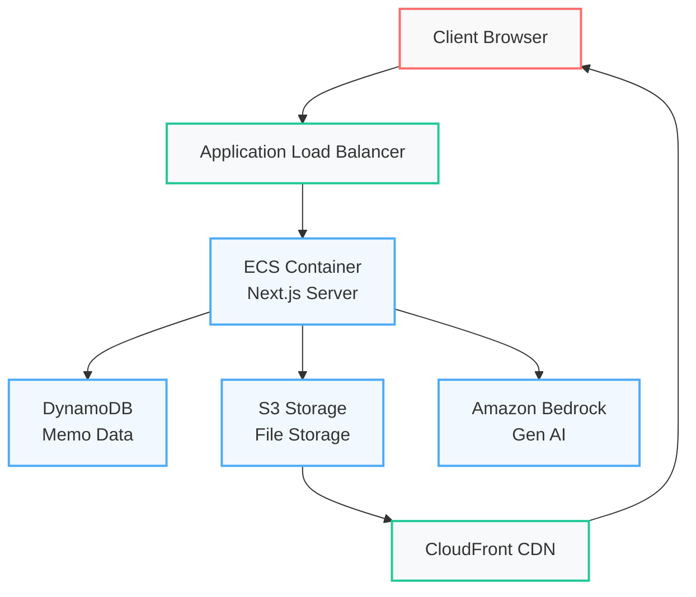

# NEXT Memo

A feature-rich fullstack memo application built with Next.js that supports markdown editing, file uploads, and AI-powered content analysis.

## 🚀 Features

### Core Functionality

- 📝 **Markdown Editor**: Rich text editing with markdown support
- ✨ **CRUD Operations**: Create, Read, Update, and Delete memos
- 🏷️ **Smart Categorization**: Organize memos using emoji categories
- ⭐ **Priority System**: Filter memos based on importance levels
- 🔍 **Full-text Search**: Powerful search capabilities powered by DynamoDB

### File Management

- 📁 **Drag & Drop**: Intuitive file upload interface
- 🖼️ **Image Support**: Upload and display images in memos
- 📎 **Auto Markdown**: Automatic markdown conversion for uploaded files
- ⬇️ **Downloads**: Easy file download functionality
- 🗄️ **CDN Delivery**: Fast file access through CloudFront CDN

### AI Features

- 🤖 **Auto Summary**: Automatic memo summarization using Amazon Bedrock
- 🏷️ **Smart Tags**: AI-powered tag generation
- 📊 **Content Analysis**: Intelligent content processing

## 🛠️ Tech Stack

### Application

- **Framework**: Next.js (Fullstack)
  - Server-side: Next.js API Routes & Server Actions
  - Client-side: React Components & Hooks
- **Features**:
  - Responsive markdown editor
  - Real-time content updates
  - Drag & drop file upload interface
  - Dynamic content rendering

### AWS Services

- **Compute**:
  - ECS (Container Orchestration)
  - ECR (Container Registry)
  - ALB (Load Balancing)
- **Storage & Database**:
  - DynamoDB (Primary Database)
  - S3 (File Storage)
  - CloudFront (CDN)
- **AI/ML**:
  - Amazon Bedrock (Generative AI)

## 🏗️ Architecture



## 📦 Data Structure

### DynamoDB Schema

- **Table**: `next-memo`
- **Primary Key**: `id` (String)
- **Global Secondary Indexes**:
  - `UpdatedIndex`:
    - HASH: `gsiPartitionKey`
    - RANGE: `updatedAt`
  - `PriorityUpdatedIndex`:
    - HASH: `priority`
    - RANGE: `updatedAt`

## 🚀 Setup & Deployment

### Prerequisites

- AWS CLI configured
- Node.js 18 or higher
- Docker

### Development

```bash
# Install dependencies
npm install

# Run the development server
npm run dev
```

### Local Environment Setup

Create `.env.local` file:

```env
AWS_REGION=ap-northeast-2
DYNAMODB_TABLE=next-memo
AWS_S3_BUCKET=your-bucket-name
AWS_CLOUDFRONT_URL=your-cloudfront-domain
```

### Database Setup

<details>
<summary>DynamoDB Table Creation</summary>

```sh
aws dynamodb create-table \
  --table-name next-memo \
  --attribute-definitions \
    AttributeName=id,AttributeType=S \
    AttributeName=priority,AttributeType=N \
    AttributeName=updatedAt,AttributeType=N \
    AttributeName=gsiPartitionKey,AttributeType=S \
  --key-schema \
    AttributeName=id,KeyType=HASH \
  --billing-mode PAY_PER_REQUEST \
  --global-secondary-indexes \
    '[{
      "IndexName": "UpdatedIndex",
      "KeySchema": [
        {"AttributeName": "gsiPartitionKey", "KeyType": "HASH"},
        {"AttributeName": "updatedAt", "KeyType": "RANGE"}
      ],
      "Projection": {"ProjectionType": "ALL"}
    },
    {
      "IndexName": "PriorityUpdatedIndex",
      "KeySchema": [
        {"AttributeName": "priority", "KeyType": "HASH"},
        {"AttributeName": "updatedAt", "KeyType": "RANGE"}
      ],
      "Projection": {"ProjectionType": "ALL"}
    }]'
```
</details>

## 🔄 Future Enhancements

- OpenSearch integration for advanced search capabilities
- Enhanced AI features using Bedrock
- Real-time collaboration feature

## 📝 License

This project is licensed under the [MIT License](./LICENSE)